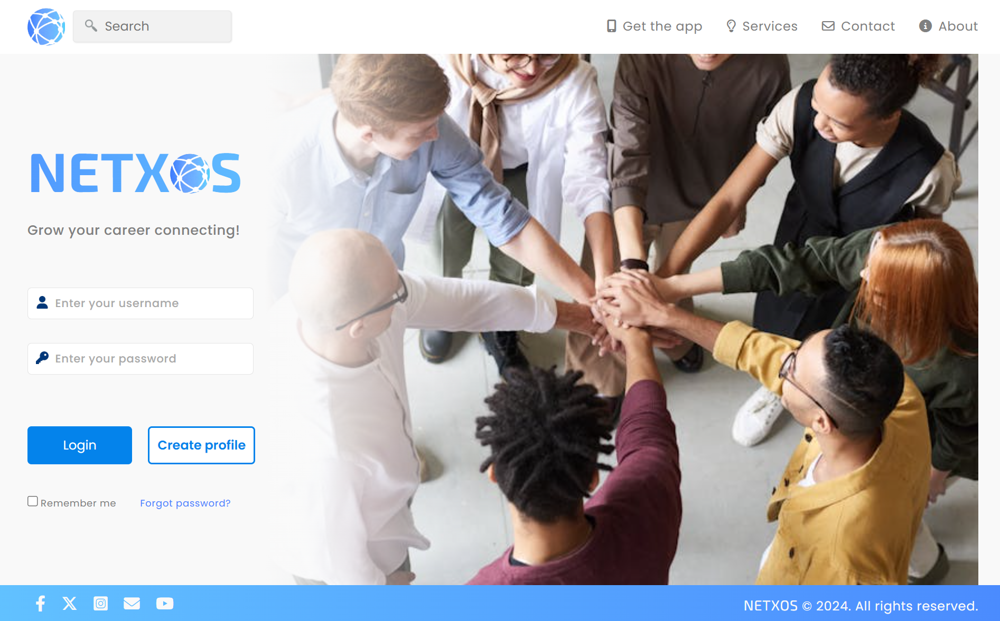

# NETXOS

This web application was designed for a fictional platform similar to LinkedIn, and includes features such as fetching data random-user API and LocalStorage. Below are more the details about the project.

## 🔗Project Demo
You can see the live demo of the project [here](https://fabianmendozaospina.github.io/netxos/).



## 📑Table of Contents
- [Technologies Used](#technologies-used)
- [Installation](#installation)
- [Features](#features)

## 🖥️Technologies Used


## 🖱️Installation
To run this project locally, follow these steps:
1. Clone the repository:
    ```sh
    git clone https://github.com/fabianmendozaospina/netxos.git
    ```
2. Navigate to the project directory:
    ```sh
    cd networkly
    ```
3. Open `index.html` in your browser to view the application.


4. Enter this credentials:
    - Username: johnsmith
    - Password: 123456

## 💡Features

### User Authentication:
- Login functionality that verifies user credentials stored in localStorage.
- Error messaging for incorrect username or password attempts.

### Responsive Design:
- Adapts to different screen sizes and devices.

### Profile Management:
- Allows the user to manually add picture and data to the feed.
- Displays profiles of at least 10 other users fetched from the Random User API, showcasing their profile pictures, full names, and cities.

### Customizable Styling:
- Consistent use of colors, fonts, and design elements to maintain a professional and cohesive look throughout the application.

&copy; Created by MITT Software Students.