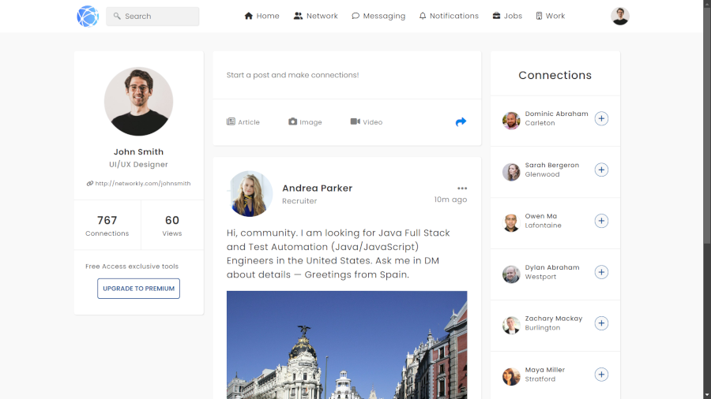

# Global Shipping

This project was developed for Program Developer students, focusing on tools like Git and GitHub while working remotely. This web application was designed for a fictional delivery company called 'Global Shipping', and includes features such as a geolocalization (Geolocation and MapBox APIs), modal dialogs, and responsive design. Below are the details of the project's structure and functionality.

## 🔗Project Demo
You can see the live demo of the project [here](https://douglasfssantiago.github.io/global-shipping/).



## 📑Table of Contents
- [Technologies Used](#technologies-used)
- [Installation](#installation)
- [Folder Structure](#project-structure)
- [Features](#features)

## 🖥️Technologies Used


## 🖱️Installation
To run this project locally, follow these steps:
1. Clone the repository:
    ```sh
    git clone https://github.com/douglasfssantiago/global-shipping.git
    ```
2. Navigate to the project directory:
    ```sh
    cd global-shipping
    ```
3. Open `index.html` in your browser to view the application.


## Folder Structure
├── assets
│   ├── css
│   │   └── style.css
│   ├── img
│   │   ├── favicon.png
│   │   ├── hero-banner-img.png
│   │   ├── banner.jpg
│   │   └── download-app-img.png
│   ├── js
│   │   ├── app.js
│   │   └── map.js
├── index.html
└── README.md


## 💡Features
### Header
- Logo and navigation menu.
- Dropdown menu for additional links.

### Banner 
- Prominent hero banner to showcase key promotions or announcements.
- Visually engaging with space for images and text.

### Modal Dialog
- Log in/Register modal for user authentication.
- Form validation and submission.

### Services
- Showcases the services provided by the company.

### Contact Us
- Contact form for users to send messages.
- Input fields for name, email, and message, with validation.

### Footer
- Social media links.
- Company information.

&copy; Created by MITT Software Students.